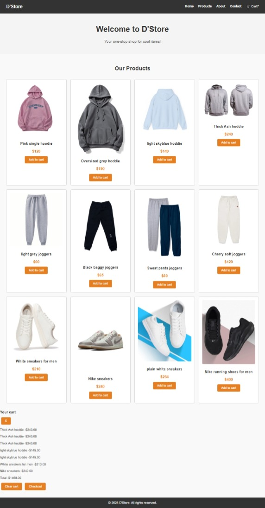

# 🛒 D'Store - E-Commerce Clothing Website

D'Store is a simple **frontend e-commerce website** built with **HTML, CSS, and JavaScript**.  
It allows users to browse clothing products, add them to a cart, and view the cart with a running total.  

This project is part of my learning journey in **web development**, and I plan to expand it in the future with **React** and backend technologies.

---

## 🚀 Features

- Browse products (hoodies, joggers, sneakers, etc.)
- Add items to cart
- View cart with:
  - Product name
  - Price
  - Total calculation
- Clear cart button
- Checkout button (currently shows an alert with the total)

---

## 🛠️ Tech Stack
- **HTML5** – structure  
- **CSS3** – styling  
- **JavaScript** – interactivity  

---
## Screenshots

---

## 📂 Project Structure
- `index.html` → Main file  
- `style.css` → Stylesheet  
- `script.js` → JavaScript functionality  

---

## 💡 Future Improvements

- Add a backend with **Node.js / Express** or **Django**  
- Store cart data in a database  
- Connect checkout to a real payment gateway (Stripe, PayPal, etc.)  
- Rebuild with **React** for better scalability and performance  

---

## 📦 Deployment

This project can be deployed using:  
- **GitHub Pages**  
- **PXXL** (recommended for React upgrades later)  

---

## 👨‍💻 Author

- **Your Name**  
- GitHub: [CodewithDivine](https://github.com/CodewithDivine-commits)  

---

✨ Thanks for checking out my project!
